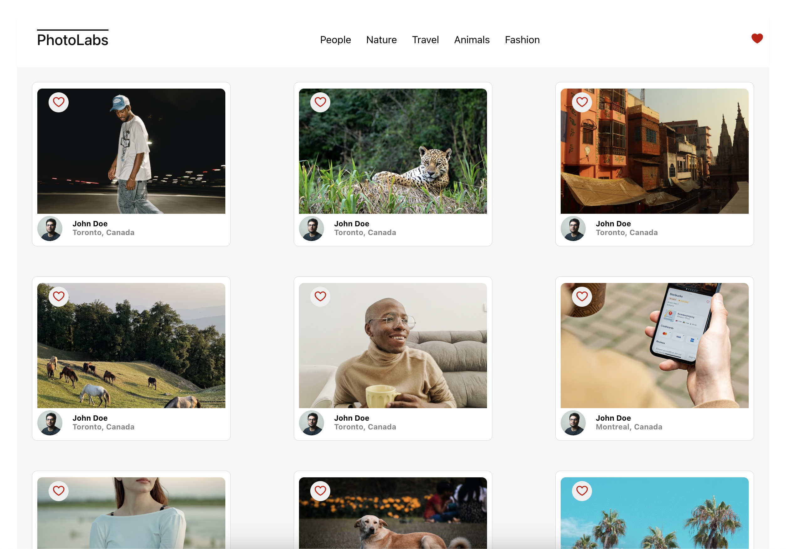

# react-photolabs

The PhotoLabs project for the Web Development React course programming.

# Photolabs

## Setup

Install dependencies with `npm install` in each respective `/frontend` and `/backend`.

## [Frontend] Running Webpack Development Server

```sh
cd frontend
npm start
```

## [Backend] Running Backend Server

Read `backend/readme` for further setup details.

```sh
cd backend
npm start
```

# PhotoLabs

PhotoLabs is a web application that allows users to explore and manage a collection of photos by various topics. Users can view photo details, add photos to their favorites, and filter photos by topics.

## Table of Contents

- [Introduction](#introduction)
- [Features](#features)
- [Installation](#installation)
- [Usage](#usage)
- [Screenshots](#screenshots)
- [Technologies Used](#technologies-used)
- [Contributing](#contributing)
- [Contact](#contact)

## Introduction

PhotoLabs is designed to provide an intuitive and interactive experience for users who are interested in managing and exploring a vast collection of photos. The application fetches photo data from an API and allows users to filter, select, and favorite photos based on their preferences.

## Features

- View a collection of photos
- Filter photos by topics
- View enlarged photos with details
- View similar photos to the selected photo
- Add photos to favorites
- Responsive design for various devices

## Installation

To run PhotoLabs locally, follow these steps:

1. **Clone the repository:**
   ```bash
   git clone https://github.com/bhood239/photolabs.git
   ```
2. **Navigate to the project directory:**
   ```bash
   cd photolabs
   ```
3. **Install dependencies from frontend and backend directories:**
   ```bash
   cd frontend
   npm install
   ```
   ```bash
   cd backend
   npm install
   ```
4. **Set up environment variables:**
   - Create a `.env` file in the root of the project.
   - Add your environment variables (e.g., API endpoints) to the `.env` file.
5. **Start the development servers from frontend and backend directories in seperate console windows:**
   ```bash
   cd frontend
   npm start
   ```
   ```bash
   cd backend
   npm start
   ```

## Usage

Once the development server is running, you can access the application in your web browser at `http://localhost:3000`.

- **Browse Photos:** View the photos fetched from the API.
- **Filter by Topics:** Select a topic to filter the displayed photos.
- **View Details:** Click on a photo to view its details.
- **Add to Favorites:** Mark photos as favorites for easy access later.

## Screenshots

_Add screenshots of your application here._

Example:


_Home Page View_


_Photo Details View_

## Technologies Used

- **Frontend:**

  - React
  - HTML
  - CSS

- **Backend:**

  - Node.js
  - Express

- **Database:**

  - PostgreSQL

- **Libraries and Tools:**
  - Axios
  - Jest (for testing)

## Contributing

Contributions are welcome! Please follow these steps to contribute:

1. **Fork the repository:**

   - Click the "Fork" button on the top right of the repository page.

2. **Clone your fork:**

   ```bash
   git clone https://github.com/bhood239/photolabs.git
   ```

3. **Create a new branch:**

   ```bash
   git checkout -b feature/your-feature-name
   ```

4. **Make your changes:**

   - Implement your feature or bugfix.

5. **Commit your changes:**

   ```bash
   git commit -m 'Add feature/your-feature-name'
   ```

6. **Push to your fork:**

   ```bash
   git push origin feature/your-feature-name
   ```

7. **Open a Pull Request:**
   - Go to the repository on GitHub and click "New Pull Request".

## Contact

For any inquiries or questions, please contact:

- Your Name: [benhood97@btinternet.com](mailto:benhood97@btinternet.com)
- GitHub: [https://github.com/bhood239](https://github.com/bhood239)
